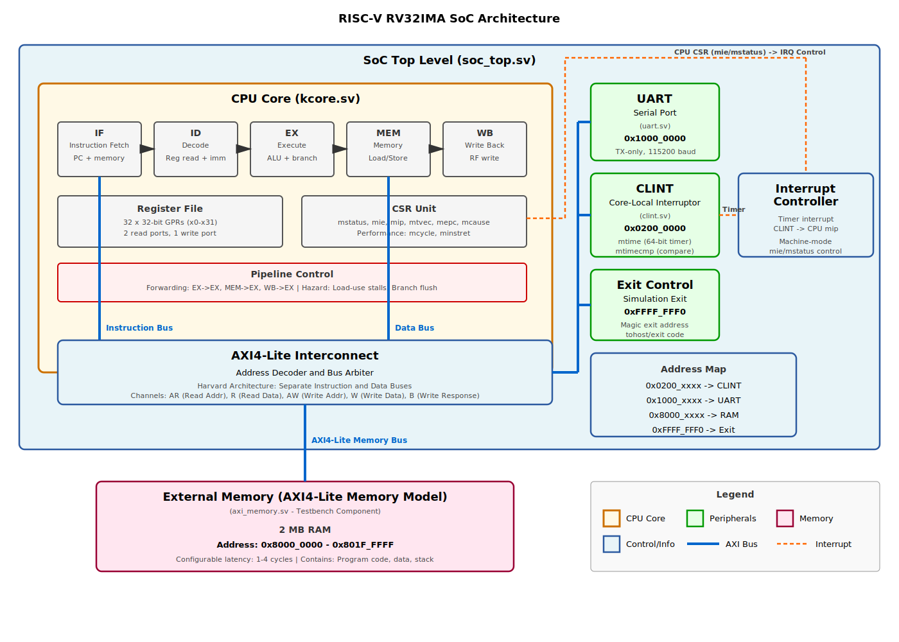
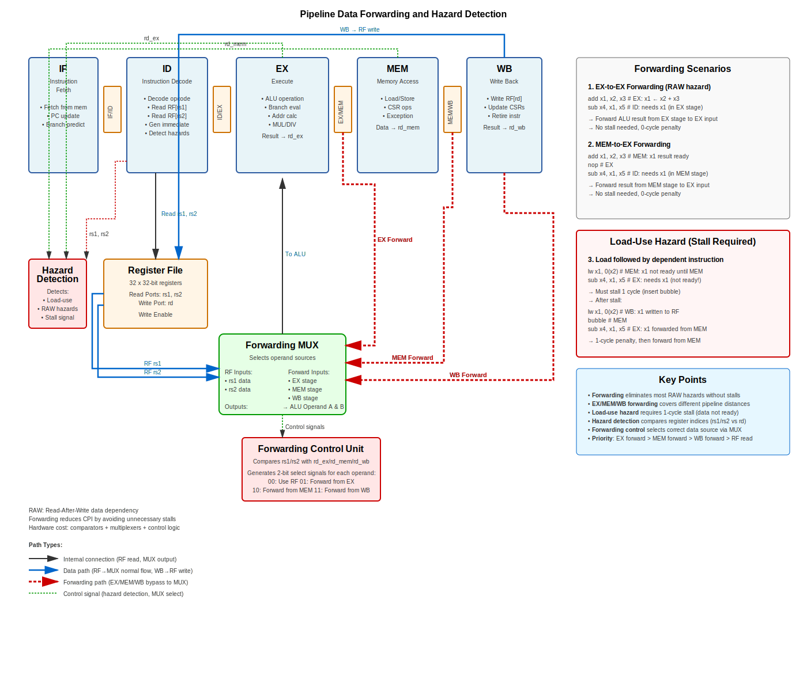

# RISC-V 32-bit IMA Pipelined Processor

A complete RISC-V RV32IMA processor implementation with 5-stage pipeline, supporting interrupts and comprehensive verification infrastructure.

> **⚠️ IMPORTANT NOTE**  
> - For detailed project status, completion tracking, and current issues, see [`PROJECT_STATUS.md`](PROJECT_STATUS.md)
> - For quick start instructions, see [`QUICKSTART.md`](QUICKSTART.md)

## Configuration Requirements

### Critical Hardware Constraints

1. **UART Baud Divisor: BAUD_DIV ≥ 4**  
   The UART RX receiver requires a minimum of 4 clock cycles per bit for reliable sampling at the bit center. This is a hardware timing constraint in the receive state machine. For example, at 50 MHz clock:
   - Minimum BAUD_DIV = 4 → Maximum baud rate = 12.5 Mbaud
   - Formula: `Baud Rate = CLK_FREQ / BAUD_DIV`

2. **Memory Size for RISCOF Tests: 2MB Required**  
   The RISC-V architectural compliance test suite requires 2MB of memory. The `jal-01` test generates a 1.76MB binary that overflows with smaller memory configurations:
   - 1MB configuration: 37/38 tests pass (jal-01 fails with linker overflow)
   - 2MB configuration: 38/38 tests pass ✓
   - Memory base address: 0x8000_0000
   - Both testbench memory (`tb_soc.sv`) and linker script (`verif/riscof_targets/kcore/env/link.ld`) must be configured for 2MB

## Table of Contents

- [RISC-V 32-bit IMA Pipelined Processor](#risc-v-32-bit-ima-pipelined-processor)
  - [Configuration Requirements](#configuration-requirements)
    - [Critical Hardware Constraints](#critical-hardware-constraints)
  - [Table of Contents](#table-of-contents)
  - [Features](#features)
  - [System Architecture](#system-architecture)
    - [Block Diagram](#block-diagram)
    - [Pipeline Forwarding and Hazard Detection](#pipeline-forwarding-and-hazard-detection)
  - [Getting Started](#getting-started)
    - [Prerequisites \& Setup](#prerequisites--setup)
    - [Quick Start](#quick-start)
  - [Building and Running](#building-and-running)
    - [Available Targets](#available-targets)
    - [Parameters](#parameters)
    - [Quick Examples](#quick-examples)
    - [Performance Tips](#performance-tips)
    - [Build Directories](#build-directories)
    - [Build Steps Details](#build-steps-details)
      - [Compile Software](#compile-software)
      - [Build RTL Simulation](#build-rtl-simulation)
      - [Run RTL Simulation](#run-rtl-simulation)
      - [Run Software Simulator \& Compare Traces](#run-software-simulator--compare-traces)
    - [ELF Program Loading](#elf-program-loading)
    - [Viewing Waveforms](#viewing-waveforms)
  - [Test Programs](#test-programs)
    - [Simple Test (`sw/simple/`)](#simple-test-swsimple)
    - [Hello Test (`sw/hello/`)](#hello-test-swhello)
    - [Full Test (`sw/full/`)](#full-test-swfull)
    - [Interrupt Test (`sw/interrupt/`)](#interrupt-test-swinterrupt)
    - [Dhrystone (`sw/dhry/`)](#dhrystone-swdhry)
  - [FreeRTOS Integration](#freertos-integration)
    - [Overview](#overview)
    - [Configuration](#configuration)
    - [Build Commands](#build-commands)
    - [Available Tests](#available-tests)
    - [Known Limitations](#known-limitations)
  - [Zephyr RTOS Integration](#zephyr-rtos-integration)
    - [Overview](#overview-1)
    - [Features](#features-1)
    - [Building](#building)
    - [Console Drivers](#console-drivers)
    - [Documentation](#documentation)
  - [RISCOF Architectural Testing](#riscof-architectural-testing)
  - [Directory Structure](#directory-structure)
  - [Debugging and Customization](#debugging-and-customization)
  - [Verification Strategy](#verification-strategy)
  - [Additional Resources](#additional-resources)

## Features

**ISA Support**: RV32IM + Partial A-extension (Base Integer + Multiply/Divide + Atomics)
- **RV32I**: Base integer instructions ✅ (38/38 tests passing, 100%)
- **M-extension**: Multiply/Divide ✅ (8/8 tests passing, 100%)
- **A-extension**: Atomic operations ⚠️ (5/9 tests passing, 56% - basic ops work, min/max under debug)

**Architecture**:
- 5-stage pipeline (IF, ID, EX, MEM, WB)
- Data forwarding for hazard resolution
- AXI4-Lite memory interface with byte-level access (verified working)
- Atomic memory operations with read-modify-write FSM
- Performance: 8.13 DMIPS @ 50 MHz, CPI ~8-9
- printf() and all C library functions fully functional
- GDB remote debugging with breakpoints and watchpoints (rv32sim)

**Peripherals**:
- CLINT: Timer and software interrupts (MRET instruction fully implemented)
- UART: Full-duplex serial TX/RX with 16-entry FIFOs @ 12.5 Mbaud
  - **Limitation**: Max baud rate = CLK_FREQ / 4 (RX requires min 4 cycles/bit)
- 2MB RAM @ 0x8000_0000

**Magic Addresses**:
- `0xFFFFFFF0`: Exit signal (write exit code)
- `0xFFFFFFF4`: Console output (write character)

## System Architecture

### Block Diagram



**Key Components**:
- **CPU Core**: 5-stage pipeline with register file and CSR unit
- **AXI4-Lite Interconnect**: Address decoder for peripherals
- **Memory**: External 2MB RAM
- **Peripherals**: CLINT (timer), UART (serial), Exit/Console control

See [PROJECT_STATUS.md](PROJECT_STATUS.md) for detailed component descriptions.

### Pipeline Forwarding and Hazard Detection



The CPU implements data forwarding to minimize pipeline stalls from data dependencies.

**Forwarding Paths**:
1. **EX→EX**: 0-cycle penalty, handles back-to-back dependencies
2. **MEM→EX**: 0-cycle penalty, covers 1-instruction gap
3. **WB→EX**: 0-cycle penalty, covers 2-instruction gap

**Load-Use Hazard**: Requires 1-cycle stall when an instruction immediately uses load result.

**Implementation**:
- Unified 4-input MUX block for operand selection
- 2-bit control signals for forwarding path selection
- Hazard detection unit monitors register dependencies
- Forwarding priority: EX > MEM > WB > Register File

For detailed forwarding logic and hazard detection, see the diagram above.

## Getting Started

### Prerequisites & Setup

For detailed prerequisites, tool requirements, and environment configuration, see **[QUICKSTART.md](QUICKSTART.md)**.

**Required Tools**:
- RISC-V GCC toolchain, Verilator v5.0+, Python 3
- Optional: Spike ISA simulator (default) or use built-in rv32sim (`USE_SPIKE=0`)
- Tool paths configured in `env.config` file

**Verify Setup**:
```bash
make info    # Display configured tool paths and versions
```

### Quick Start

```bash
# Verify configuration
make info

# Run simple test (fastest)
make verify-simple

# Run comprehensive test
make verify-full

# View waveforms
make rtl ARGS=+WAVE
make wave
```

See [QUICKSTART.md](QUICKSTART.md) for detailed instructions.

## Building and Running

### Available Targets

```bash
# Build and verification targets
make all              # Build software, RTL sim, and software sim
make sw[-<test>]      # Compile software test program (default or specific test)
make build-<test>     # Build Verilator RTL simulation for specific test
make rtl[-<test>]     # Run RTL simulation (validates test exists)
make sim[-<test>]     # Run software simulator (validates test exists)
make compare[-<test>] # Compare RTL and simulator traces
make verify[-<test>]  # Complete verification: clean, build, run, compare (validates test)
make wave             # View waveform with GTKWave
make clean            # Remove build artifacts
make info             # Show tool configuration
make help             # Show detailed help

# FreeRTOS targets (validates sample exists)
make freertos-rtl-<sample>     # Run FreeRTOS sample in RTL
make freertos-sim-<sample>     # Run FreeRTOS sample in simulator
make freertos-compare-<sample> # Compare FreeRTOS RTL vs simulator

# Zephyr RTOS targets (validates sample exists)
make zephyr-rtl-<sample>     # Run Zephyr sample in RTL
make zephyr-sim-<sample>     # Run Zephyr sample in simulator
make zephyr-compare-<sample> # Compare Zephyr RTL vs simulator
```

### Parameters

- **`TEST=<name>`**: Select test program (default: simple)
  - Examples: simple, full, hello, interrupt, uart, dhry
- **`WAVE=<fst|vcd>`**: Enable waveform dump (default: none for speed)
  - `fst`: Fast Signal Trace (compact, recommended)
  - `vcd`: Value Change Dump (universal format)
- **`TRACE=<0|1>`**: Enable RTL trace logging to rtl_trace.txt (default: 0)
- **`MEMTRACE=<0|1>`**: Enable memory transaction logging (default: 0)
  - Auto-enables FST waveform if WAVE not set
  - Generates build/mem_trace.txt and runs verification
  - Note: Some AXI fetches may not match CPU reads due to pipeline flushes (branches/interrupts) - this is correct
- **`MAX_CYCLES=<n>`**: Set simulation cycle limit (default: 10M)
  - Use 0 for unlimited cycles
- **`USE_SPIKE=<0|1>`**: Select software simulator (default: 1)
  - `1`: Use Spike ISA simulator (default, requires Spike installation)
  - `0`: Use built-in rv32sim (always available, includes GDB support)

### Quick Examples

```bash
# Fast runs (no waveform)
make rtl                              # Default test, no waveform
make rtl-interrupt                    # Interrupt test, no waveform
make verify-full                      # Full verification suite

# Debug runs (with waveforms)
make rtl-interrupt WAVE=fst           # Interrupt test with FST waveform
make rtl WAVE=vcd TRACE=1             # VCD waveform + RTL trace
make TEST=hello rtl WAVE=fst          # Hello test with FST waveform

# Benchmarks and long runs
make rtl-dhry MAX_CYCLES=0            # Dhrystone with unlimited cycles

# Memory debugging
make memtrace-simple                  # Memory trace for simple test

# Build system
make build-hello                      # Build RTL for hello test
make sw-interrupt                     # Compile interrupt test software
make sim-full                         # Run software simulator (Spike by default)
make sim-full USE_SPIKE=0             # Run with rv32sim instead
make compare-simple                   # Compare RTL vs simulator traces
make compare-simple USE_SPIKE=0       # Compare using rv32sim
```

### Performance Tips

- **No waveform** is ~2x faster (use for regression, quick tests)
- **FST** is 15x smaller than VCD (22KB vs 330KB for simple test)
- **TRACE=1** adds instruction trace overhead, use only when needed
- **MEMTRACE=1** adds significant logging, use for memory debugging only

### Build Directories

- `build/verilator/` - Default (no waveform) builds
- `build/verilator_fst/` - FST waveform builds
- `build/verilator_vcd/` - VCD waveform builds

Separate directories allow switching modes without full rebuild.

### Build Steps Details

#### Compile Software
```bash
make sw              # Build default test (TEST=simple)
make sw-full         # Build comprehensive test (shortcut)
make TEST=full sw    # Build comprehensive test (explicit)
```

Produces:
- `build/test.elf` - Compiled test program
- `build/test.dump` - Disassembly listing

#### Build RTL Simulation
```bash
make build-verilator              # Build without waveform tracing (fastest)
make build-hello                  # Build specific test (shortcut)
make build-verilator WAVE=fst     # Build with FST waveform tracing
make build-verilator WAVE=vcd     # Build with VCD waveform tracing
```

Compiles SystemVerilog RTL with Verilator, generating a C++ simulation binary.

#### Run RTL Simulation
```bash
# No waveform (fastest, ~2x speedup)
make rtl                # Run default test
make rtl-interrupt      # Run interrupt test (shortcut for TEST=interrupt rtl)
make TEST=hello rtl     # Run hello test

# With FST waveform (compact, recommended for debugging)
make rtl WAVE=fst           # Run default test
make rtl-interrupt WAVE=fst # Run interrupt test with FST
make TEST=hello rtl WAVE=fst # Run hello test with FST

# With VCD waveform (universal format)
make rtl WAVE=vcd           # Run default test
make rtl-interrupt WAVE=vcd # Run interrupt test with VCD
make TEST=full rtl WAVE=vcd # Run full test with VCD

# Control simulation cycles
make rtl MAX_CYCLES=100000        # Custom limit
make rtl-interrupt MAX_CYCLES=0   # Unlimited cycles
```

#### Run Software Simulator & Compare Traces
```bash
make sim                  # Run software simulator
make compare              # Auto-runs both simulators and compares
make compare-mytest       # Custom test (shortcut)
make TEST=mytest compare  # Custom test (explicit)
```

### ELF Program Loading

The testbench includes a custom ELF loader with no external dependencies:

**Features**:
- Parses ELF32 format directly (no libelf required)
- Loads program segments with proper memory mapping
- Extracts symbol table (tohost, fromhost addresses)
- Auto-detects file format (ELF or binary fallback)
- Comprehensive error reporting with helpful hints

**Build Output** (software compilation):
- `build/test.elf` - Executable (loaded directly by simulator)
- `build/test.dump` - Disassembly with addresses
- `build/test.dis` - Disassembly with source
- `build/test.map` - Link map with symbols

**No intermediate files**: The build system no longer generates `.bin` or `.hex` files. All simulations load ELF files directly for faster builds and symbol access.

See [testbench/elfloader.h](testbench/elfloader.h) and [PROJECT_STATUS.md](PROJECT_STATUS.md) for implementation details.

### Viewing Waveforms

```bash
# Generate waveforms
make rtl WAVE=fst     # FST format (compact, recommended)
make rtl WAVE=vcd     # VCD format (universal)

# View waveforms
make wave             # Open GTKWave (works with FST or VCD)
```

**Waveform saved to**: `build/dump.fst` or `build/dump.vcd`

**Waveform Options**:
- **No waveform** (`rtl`): ~2x faster, use for quick testing
- **FST format** (`WAVE=fst`): Compact, fast, recommended for debugging
- **VCD format** (`WAVE=vcd`): Universal format, larger files

**Alternative**: Use Surfer VS Code extension to view waveforms directly in VS Code.

## Test Programs

### Simple Test (`sw/simple/`)
Minimal smoke test - single NOP, ~150 cycles, ~400 bytes

### Hello Test (`sw/hello/`)
Console output using magic address (0xFFFFFFF4)

### Full Test (`sw/full/`)
Comprehensive ISA test covering (11 tests total):
- Arithmetic, logic, shifts, branches
- Load/store operations
- M-extension (multiply/divide)
- FENCE memory ordering instructions
- UART and CLINT peripherals

### Interrupt Test (`sw/interrupt/`)
Timer interrupt handling verification

### Dhrystone (`sw/dhry/`)
Performance benchmark (8.13 DMIPS @ 50 MHz)

See [PROJECT_STATUS.md](PROJECT_STATUS.md) and [sw/README.md](sw/README.md) for detailed test descriptions.

## FreeRTOS Integration

**Status**: ✅ FreeRTOS V11.2.0 fully integrated with RISC-V RV32IMA support

### Overview
Real-time operating system (RTOS) integration providing task scheduling, synchronization, and dynamic memory management.

### Configuration
- **Version**: FreeRTOS V11.2.0 kernel
- **Tick Rate**: 1 kHz (1 ms period)
- **CPU Clock**: 50 MHz
- **Heap Size**: 64KB (heap_3, malloc/free based)
- **Memory**: 2MB RAM (configurable stack/heap)
- **Timer**: CLINT hardware timer (mtime/mtimecmp)

### Build Commands
```bash
# Build and run FreeRTOS tests
make freertos-simple              # Build simple test
make freertos-rtl-simple          # Run on RTL simulation
make freertos-rtl-simple TRACE=1  # Run with instruction trace
make freertos-rtl-simple WAVE=fst # Run with FST waveform

# Available options
make freertos-rtl-<test> MEMTRACE=1  # Memory trace
make freertos-rtl-<test> MAX_CYCLES=0 # Unlimited cycles
```

### Available Tests
- **simple**: Two-task scheduling demo with cooperative multitasking
- **perf_test**: Performance validation

### Known Limitations
⚠️ **Timer Interrupts**: `vTaskDelay()` causes exceptions. Current workaround uses busy-wait + `taskYIELD()` for cooperative scheduling.

For detailed configuration and technical details, see [PROJECT_STATUS.md - FreeRTOS Integration](PROJECT_STATUS.md#freertos-integration-january-1-2026).

## Zephyr RTOS Integration

**Status**: ✅ Complete Zephyr RTOS port with SoC, board, drivers, and sample application

### Overview

Full Zephyr RTOS port for the kcore RV32IM processor with out-of-tree SoC and board definitions.

**Port Components**:
- **SoC Definition**: Custom RISC-V RV32IM kcore SoC configuration
- **Board Support**: kcore_board with complete device tree
- **Console Drivers**: 
  - Magic Address Console (0xFFFFFFF4) - Fast simulation, instant output
  - UART Console (0x10000000) - Hardware accurate, 115200 baud
- **Sample Application**: Hello World with k_msleep() and counter loop

### Features

- **Architecture**: RV32IM support (Base Integer + Multiply/Divide)
- **System Clock**: 50 MHz
- **Memory**: 2MB RAM @ 0x80000000
- **Console Options**:
  - Magic Address (default) - 10-100x faster simulation
  - UART (optional) - Hardware-accurate timing
- **CLINT**: Timer and interrupt controller support
- **Minimal Footprint**: Size-optimized for embedded systems

### Building

Using West (Zephyr's build tool):

```bash
cd rtos/zephyr/samples/hello

# Configure environment
export ZEPHYR_BASE=~/zephyrproject/zephyr
export ZEPHYR_EXTRA_MODULES=/path/to/riscv/rtos/zephyr

# Build
west build -b kcore_board

# Binary at: build/zephyr/zephyr.elf
```

### Console Drivers

**Magic Address Console (Default)**:
- Writes to 0xFFFFFFF4 for instant console output
- 10-100x faster simulation performance
- No baud rate or FIFO delays
- Perfect for testing and development
- `CONFIG_CONSOLE_KCORE=y`

**UART Console (Optional)**:
- Full hardware UART driver with FIFO
- Accurate timing simulation (115200 baud)
- Better for hardware validation
- `CONFIG_UART_CONSOLE=y`, `CONFIG_SERIAL=y`

Switch drivers by editing `prj.conf` in your application:
```ini
# Fast (default)
CONFIG_CONSOLE_KCORE=y

# Or hardware accurate
CONFIG_UART_CONSOLE=y
CONFIG_SERIAL=y
```

### Documentation

For complete setup, prerequisites, integration options, and customization details, see:
- [rtos/zephyr/README.md](rtos/zephyr/README.md) - Complete Zephyr port documentation
- [rtos/zephyr/samples/hello/README.md](rtos/zephyr/samples/hello/README.md) - Sample application guide

## RISCOF Architectural Testing

**Status**: ✅ All RV32I and RV32M tests passing

The processor has been tested against the official RISC-V architectural test suite using RISCOF (RISC-V COmpliance Framework).

**Test Results**:
- ✅ **RV32I**: 38/38 tests passing (100%) - All base integer instructions verified
- ✅ **RV32M**: 8/8 tests passing (100%) - Multiply/divide operations verified
- ⚠️ **RV32A**: 5/9 tests passing (56%) - Basic atomics working, min/max need fixes

**Quick Commands**:
```bash
make arch-test-rv32i    # Run RV32I tests (38/38 pass)
make arch-test-rv32m    # Run RV32M tests (8/8 pass)

# View detailed results
firefox verif/riscof_targets/riscof_work/report.html
```

For detailed RISCOF setup and usage, see [verif/riscof_targets/README.md](verif/riscof_targets/README.md).

## Directory Structure

```text
riscv/
├── docs/              # Documentation, diagrams, and technical notes
├── rtl/               # SystemVerilog RTL sources (CPU core, CSR, CLINT, UART, SoC)
├── testbench/         # Verilator testbench (C++ with ELF loader, SystemVerilog wrapper)
│   ├── tb_main.cpp    # Main testbench with ELF program loading
│   ├── elfloader.cpp/h  # Custom ELF parser (no external dependencies)
│   ├── tb_soc.sv      # SystemVerilog wrapper
│   └── axi_memory.sv  # AXI memory model
├── rtos/              # Real-Time Operating Systems
│   ├── freertos/      # FreeRTOS V11.2.0 integration
│   │   ├── include/   # API headers and configuration
│   │   ├── sys/       # RISC-V startup, linker, syscalls
│   │   ├── samples/   # Sample applications
│   │   ├── portable/  # RISC-V port (context switch)
│   │   └── [kernel]   # Core FreeRTOS sources
│   └── zephyr/        # Zephyr RTOS port
│       ├── soc/       # SoC definition (RV32IM)
│       ├── boards/    # Board support package
│       ├── drivers/   # Device drivers (console, serial)
│       ├── dts/       # Device tree bindings
│       └── samples/   # Sample applications
├── sw/                # Software test programs
│   ├── common/        # Shared startup code and linker scripts
│   ├── include/       # Shared headers
│   └── [tests]/       # Test programs (simple, hello, uart, interrupt, benchmarks)
├── sim/               # Simulation and analysis tools
├── syn/               # Synthesis scripts and configurations
├── verif/             # Verification infrastructure
│   ├── formal_configs/     # Formal verification (SymbiYosys, RVFI)
│   ├── riscof_targets/     # RISCOF architecture test targets
│   ├── riscv-formal/       # RISC-V Formal framework (submodule)
│   └── riscv-arch-test/    # RISC-V Architecture Tests (submodule)
├── build/             # Build outputs (generated)
├── Makefile           # Build system
├── env.config         # Tool paths configuration
├── README.md          # Comprehensive documentation
├── QUICKSTART.md      # Quick start guide
└── PROJECT_STATUS.md  # Detailed project status
```

## Debugging and Customization

**GDB Interactive Debugging** (rv32sim only):
```bash
# Terminal 1: Start simulator with GDB stub
./build/rv32sim --gdb --gdb-port=3333 build/test.elf

# Terminal 2: Connect with GDB
riscv32-unknown-elf-gdb build/test.elf
(gdb) target remote localhost:3333
(gdb) break main
(gdb) watch myvar          # Write watchpoint
(gdb) rwatch myvar         # Read watchpoint
(gdb) awatch myvar         # Access watchpoint
(gdb) continue
```

**Enable Waveforms**:
```bash
make rtl WAVE=fst
make wave  # View in GTKWave or Surfer
```

**Enable RTL Trace**:
```bash
make rtl TRACE=1  # Instruction-level trace to build/rtl_trace.txt
```

**Enable Memory Trace**:
```bash
make memtrace-simple        # Memory transaction logging + verification
make rtl MEMTRACE=1         # Manual memory trace enable
```

**View Disassembly**:
```bash
cat build/test.dump  # Or build/test.dis with source
```

**Custom Tests**:
1. Create `sw/mytest/mytest.c`
2. Run `make verify-mytest`

**Modify Memory**:
- Edit `sw/common/link.ld` (linker script)
- Edit `rtl/soc_top.sv` (memory decoder)

**Memory Latency** (in Makefile):
```makefile
-GMEM_READ_LATENCY=1   # 1-4 cycles
-GMEM_WRITE_LATENCY=1  # 1-4 cycles
```

**Simulation Timeout**:
```bash
make rtl MAX_CYCLES=0      # Unlimited
make rtl MAX_CYCLES=10000  # Custom limit
```

## Verification Strategy

1. **Unit Tests**: Individual ISA instruction tests
2. **Integration Tests**: Peripheral and interrupt handling
3. **Trace Comparison**: RTL vs. Spike ISA simulator
4. **Memory Verification**: Transaction-level checking (14,309+ transactions verified)
5. **Performance Analysis**: CPI metrics and cycle counts
6. **Waveform Debugging**: Signal-level analysis

See [PROJECT_STATUS.md](PROJECT_STATUS.md) for verification details and [docs/memory_trace_analysis.md](docs/memory_trace_analysis.md) for memory verification methodology.

## Additional Resources

- **Quick Start**: [QUICKSTART.md](QUICKSTART.md)
- **Project Status**: [PROJECT_STATUS.md](PROJECT_STATUS.md) - detailed component descriptions, test results, known issues
- **Software Tests**: [sw/README.md](sw/README.md)
- **Simulation Tools**: [sim/README.md](sim/README.md)
- **Memory Verification**: [docs/memory_trace_analysis.md](docs/memory_trace_analysis.md)
- **Recent Implementations**:
  - [UART RX Implementation](docs/uart_rx_implementation.md) - Full-duplex bidirectional UART @ 12.5 Mbaud
  - [Makefile Target Validation](docs/makefile_target_validation.md) - Improved error handling for make targets
- **Bug Fixes**:
  - [Byte Indexing Fix](docs/byte_indexing_fix.md)
  - [Instruction Fetch Race Condition Fix](docs/instruction_fetch_race_condition_fix.md)
